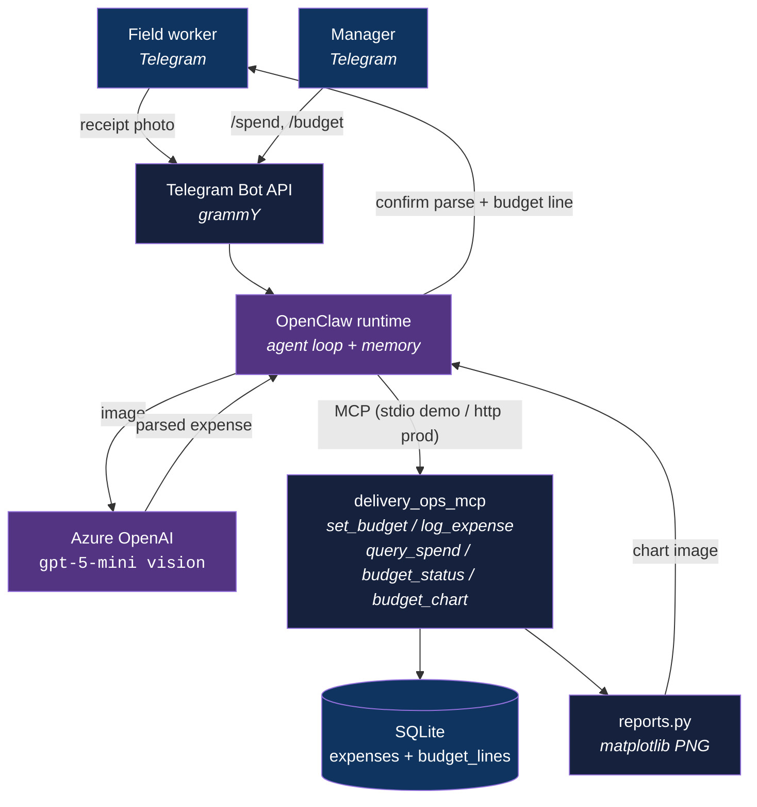

<div align="center">

# open-telegram-ops

[](https://www.python.org/downloads/)
[](LICENSE)
[](#)

**Snap a receipt in Telegram, get instant project cost accountability.**

[Getting Started](#getting-started) | [Usage](#usage) | [Architecture](#architecture)

</div>

---

## Table of Contents

- [The Problem](#the-problem)
- [Features](#features)
- [Tech Stack](#tech-stack)
- [Architecture](#architecture)
- [Getting Started](#getting-started)
  - [Prerequisites](#prerequisites)
  - [Installation](#installation)
  - [Configuration](#configuration)
- [Usage](#usage)
- [How It Works](#how-it-works)
- [Project Structure](#project-structure)
- [Deployment](#deployment)
- [Security](#security)
- [Known Issues](#known-issues)
- [License](#license)
- [Author](#author)

## The Problem

### Project costs vanish into paper

A telecom subcontractor runs daily field operations and tracks every cost on physical receipts. Nothing is centralized, no one sees the running spend, and budgets drift without anyone owning the leak. Form-based tracking has already failed here: field crews will not stop to fill a form, which is exactly why it is still paper.

### The solution

Capture happens where the crew already lives. A worker photographs a receipt in Telegram, an agent reads the amount, vendor, and date, attributes it to a budget line, and writes it to a delivery-ops ledger. Every entry carries the submitter's identity, so accountability is automatic. Managers query live spend and budget status from the same chat. The capture friction that killed the form is gone.

## Features

- **Photo-to-ledger capture** - a receipt photo becomes a structured, attributed expense in one chat turn, no form.
- **Confirm before commit** - the agent echoes the parsed amount and asks for the budget line via inline buttons, so a bad OCR read is caught before it is recorded.
- **Per-submitter accountability** - every expense is tagged with the Telegram user who logged it.
- **Manager visibility** - live budget-vs-actual summaries and on-demand charts, in-chat.
- **Decoupled delivery-ops ledger** - financial data lives in a controlled SQLite store behind a custom MCP server, not inside the agent runtime.

## Tech Stack

| Component | Technology |
|-----------|------------|
| Language | Python 3.12+ |
| Agent runtime | OpenClaw (self-hosted, Docker, pinned), Telegram via grammY |
| Domain layer | stdio MCP server (`mcp` SDK) |
| LLM | Azure OpenAI gpt-5-mini (chat + vision OCR), o4-mini reasoning escalation |
| Storage | SQLite (`aiosqlite`) |
| Charts | matplotlib |

## Architecture

The agent runtime (OpenClaw) owns the channel, conversation memory, and the LLM loop. The delivery-ops ledger is a separate MCP server we own. The runtime is swappable; the ledger and its data are not.



## Getting Started

### Prerequisites

- Python 3.12+
- A Telegram bot token from [@BotFather](https://t.me/BotFather)
- An Azure OpenAI resource (key + `.../openai/v1/` endpoint), `gpt-5-mini` deployed
- OpenClaw installed and pinned (see [`openclaw/README.md`](openclaw/README.md))

### Installation

1. Clone the repository:
   ```bash
   git clone https://github.com/adityonugrohoid/open-telegram-ops.git
   cd open-telegram-ops
   ```

2. Create and activate a virtual environment:
   ```bash
   python -m venv .venv
   source .venv/bin/activate
   ```

3. Install dependencies:
   ```bash
   pip install -r requirements.txt
   ```

### Configuration

```bash
cp .env.example .env
```

Edit `.env`. Set the Azure OpenAI key and base URL (`AZURE_OPENAI_API_KEY`, `AZURE_OPENAI_BASE_URL`), the Telegram token, the pilot project name, and the manager allowlist. See `.env.example` for the full reference.

## Usage

```bash
# Run the delivery-ops MCP server over stdio (OpenClaw launches it this way)
python -m delivery_ops_mcp.server

# Run the mandatory OCR accuracy test before building bot flows
python scripts/ocr_test/run_ocr_test.py
```

The agent flow, end to end:

1. Worker sends a receipt photo to the bot.
2. Agent replies with the parsed amount and vendor, and asks for the budget line via buttons.
3. Worker confirms or corrects. The expense is written to the ledger, tagged with their Telegram ID.
4. Manager sends `/spend this_week` or `/budget` and gets a text summary plus an optional chart.

## How It Works

### MCP tool contract

The runtime calls these tools on the delivery-ops MCP server:

| Tool | Purpose |
|------|---------|
| `set_budget` | Create or update a budget line allocation (a manager action; defines the chart of accounts) |
| `log_expense` | Write a confirmed expense (amount, vendor, date, category, budget line, submitter); rejects an undefined budget line |
| `query_spend` | Return spend for a period, broken down by budget line and by submitter; optional filters by line, category, or submitter |
| `budget_status` | Return budget-vs-actual for the active project: all budget lines, or just one |
| `budget_chart` | Render the budget-vs-actual chart as a PNG for in-chat viewing |

### Confirm before commit

OCR on field receipts is never perfect. The agent always echoes the parsed amount and vendor and waits for the worker to confirm or correct before `log_expense` writes anything. This is the core trust mechanism, not an add-on. The OCR accuracy gate in `scripts/ocr_test/` decides how heavily the UX leans on correction.

## Project Structure

```
open-telegram-ops/
├── delivery_ops_mcp/
│   ├── server.py        # MCP server (stdio or streamable-http), 3 tools
│   ├── ledger.py        # SQLite schema + async read/write
│   └── reports.py       # text summary + matplotlib chart rendering
├── openclaw/
│   ├── README.md        # runtime overview + guardrails + wiring (index)
│   ├── INSTALL.md       # local / demo install
│   ├── DEPLOYMENT.md    # 24/7 Docker deployment (sidecar topology)
│   └── openclaw.sample.json
├── deploy/
│   └── Dockerfile.mcp   # delivery-ops MCP sidecar image
├── docker-compose.yml   # gateway (stock image) + delivery-ops-mcp sidecar
├── scripts/ocr_test/
│   ├── run_ocr_test.py  # OCR accuracy harness
│   └── README.md        # 10-receipt test protocol + thresholds
├── data/                # local SQLite DB, receipts, charts (gitignored)
├── state/               # deploy volumes (gitignored)
├── tests/
├── .env.example
└── requirements.txt
```

## Deployment

### Local / demo

OpenClaw on your machine (pinned) plus the MCP server over stdio on the same host.
Full steps in [`openclaw/INSTALL.md`](openclaw/INSTALL.md).

### 24/7

Docker Compose: the OpenClaw gateway runs from the stock pinned image, and the
delivery-ops MCP server runs as a sidecar container over streamable-http. The
gateway reaches it at `http://delivery-ops-mcp:8000/mcp`.

```bash
cp .env.example .env          # fill token, project, LLM path
cp openclaw/openclaw.sample.json state/openclaw/openclaw.json
docker compose up -d --build
```

Full runbook, including why the sidecar (a stdio MCP server runs inside the gateway
container), remote access, upgrades, and backups, in
[`openclaw/DEPLOYMENT.md`](openclaw/DEPLOYMENT.md). Treat the OpenClaw state dir as
sensitive (chat transcripts hold cost figures); apply OS-level volume encryption.

## Security

- **Authentication** - manager query commands are gated by a Telegram user-ID allowlist (`MANAGER_TELEGRAM_IDS`).
- **Data handling** - cost data lives in the delivery-ops SQLite store we own, not in the agent runtime's transcripts. Internal workflow only; no sensitive personal data. Secrets stay in `.env` (gitignored); the OpenClaw state dir is never committed.
- **Supply chain** - no third-party ClawHub skills. Own code only.

To report a vulnerability, contact the maintainer directly.

## Known Issues

| Issue | Impact | Workaround |
|-------|--------|------------|
| OCR accuracy on Indonesian thermal/handwritten receipts is unproven | High | Run the OCR gate first; confirm-before-commit catches misreads |
| OpenClaw ships breaking config changes weekly | Medium | Pin the version; upgrade only in staging |
| OpenClaw MEMORY.md "dreaming" writes junk (upstream #89444) | Low | Disable the dreaming pipeline until fixed |
| OpenClaw drops async replies on idle sessions (upstream #89641) | Medium | Keep cost-entry flows synchronous |

## License

This project is licensed under the [MIT License](LICENSE).

## Author

**Adityo Nugroho** ([@adityonugrohoid](https://github.com/adityonugrohoid))
